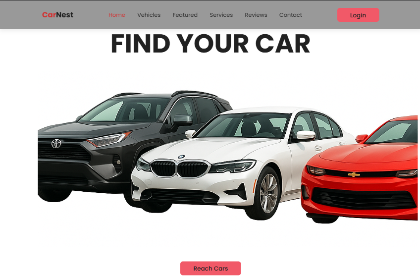
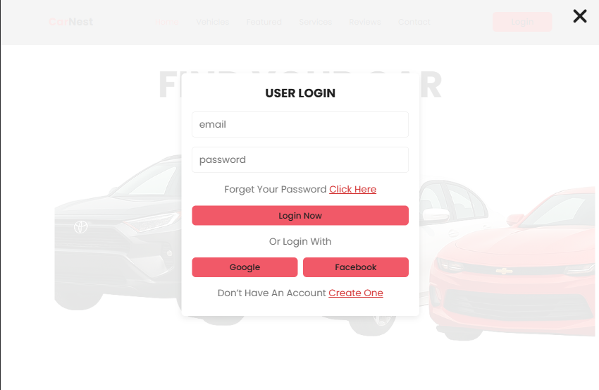
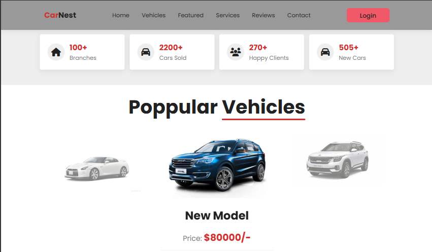

# 🚗 CarNest

CarNest is a modern and responsive car showcase website designed to provide users with an elegant browsing experience.  
The project is built using **HTML, CSS, and JavaScript**, focusing on clean design and smooth interactivity. 

## 📌 Features

- Fully responsive design (works on desktop and mobile).
- Car listings with images, prices, and specifications.
- Modern homepage layout with attractive UI.
- Option to add customer reviews or ratings.

 ## 🛠️ Technologies Used
 
- **HTML5** – Structure of the web pages.
- **CSS3** – Styling and layout.
- **JavaScript** – Interactivity and dynamic features.
- *(Future-ready for backend or database integration).*

 ## 📸 Screenshots
 ### Homepage

### Car Details

 ## ✨ Future Improvements
 
- Add a car booking system.

- Integrate with a real car API.

- Multi-language support (English / Arabic).

 ## 🌐 Live Demo
 
Check out the live version here: https://ebrahimhiggi.github.io/CarNest/

 ## 👨‍💻 Author

Ebrahim Mohamed – Frontend Developer
